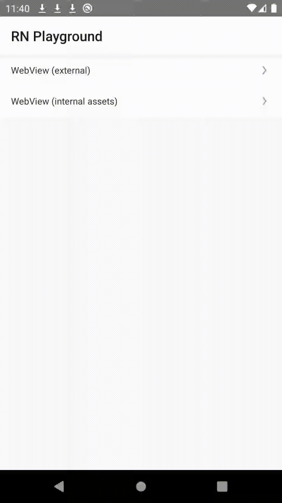

# React Native Playground

This project is a playground to test varoious features on React Native.

## Features

- PWA checklist inside WebView to see what features are supported
- SPA app loaded inside WebView to test how SPAs works within WebView
  - Camera access and screenshot saving functionality
  - File upload
  - File download
- More soon...



## Installing the package

Install dependencies:
```
yarn
cd web && yarn && yarn build
```

In order to run the App locally you need to install Android Studio for Android and Xcode for iOS.

Running Android emulator:
```
yarn start
yarn android
```

Running iOS emulator:
```
yarn start
yarn ios
```


### Running SPA

Inside `web` directory there is a React SPA app that later is included inside WebView in RN App. To be able to work on this SPA go to `web` directory and run:
```
yarn start
```
After you make the changes run `yarn build` and restart Android/iOS app to see the changes

```js

